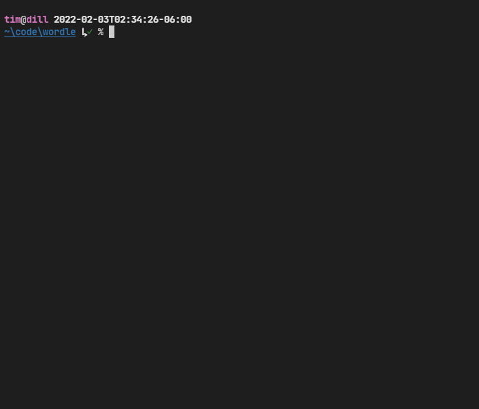

# Tim's Wordle Clone

Play wordle from the command line.



## Installation

Ensure you have Python >= 3.10.

```shell
git clone https://github.com/t-mart/wordle.git
pip install --user wordle/  # or pipx, or virtualenv, or whatever
```

Then, run it with:

```
wordle
```

## Words

The words used in this game come from the actual [Wordle](https://www.powerlanguage.co.uk/wordle/)
application itself.

- `solutions.txt` contains words which can be used as solutions. These are words that most people
  would know.
- `words.txt` contains other valid English words. These words are less common, like "fuzil",
  "sewin", and "tolan".
